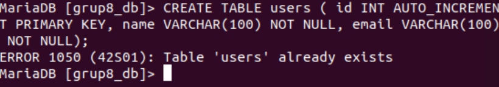

# Projecte CRUD - Gestió d'Usuaris
**ASIXc2AC - Administració de Sistemes Informàtics**

---

## Descripció del projecte

Aplicació web CRUD (Create, Read, Update, Delete) desenvolupada amb **PHP** i **MariaDB** per gestionar una base de dades d'usuaris. El projecte implementa una arquitectura client-servidor amb dos servidors separats.

### Funcionalitats principals:
- **Crear** nous usuaris
- **Llegir** i visualitzar la llista d'usuaris
- **Actualitzar** informació d'usuaris existents
- **Eliminar** usuaris de la base de dades

---

## Arquitectura del sistema

### Components:
- **Servidor Web (192.168.1.10)**: Apache + PHP
- **Servidor Base de Dades (192.168.1.30)**: MariaDB/MySQL
- **Comunicació**: mysqli (PHP MySQLi extension)

---

## Estructura del projecte

---

### Descripció dels arxius:

| Arxiu | Funció |
|-------|--------|
| **db.php** | Estableix la connexió amb la base de dades MariaDB |
| **index.php** | Mostra la llista d'usuaris i formulari per afegir-ne |
| **add.php** | Processa el formulari i insereix nous usuaris a la BBDD |
| **edit.php** | Permet modificar les dades d'un usuari existent |
| **delete.php** | Elimina un usuari de la base de dades |
| **style.css** | Estils CSS per millorar la interfície visual |

---

## Bugs identificats i solucionats

| Arxiu | Línia | Error | Solució |
|-------|-------|-------|---------|
| db.php | 2 | Typo: "locahost" | Corregit a "192.168.1.30" |
| db.php | 8 | Falta "}" de tancament | Afegit bracket de tancament |
| script.sql | 1 | "Where false" invàlid | Eliminada clàusula incorrecta |
| index.php | 16 | method="posts" | Corregit a method="post" |
| index.php | 11 | Etiqueta table duplicada | Eliminada duplicació |
| add.php | 6 | VALUES (*, ?) | Corregit a VALUES (?, ?) |
| edit.php | 13 | UPDATE...where | Corregit a UPDATE...SET |
| delete.php | 4 | DELETE * FROM | Corregit a DELETE FROM |

---

## Instal·lació i configuració

### Prerequisits
- Ubuntu Server 20.04 o superior
- Apache 2.4+
- PHP 8.0+ amb extensions: mysqli
- MariaDB/MySQL 10.5+
- Git

---

### Configuració del Servidor Web (192.168.1.10)

#### 1. Instal·lar Apache i PHP

Instal·lació dels paquets necessaris per executar l'aplicació web.

#### 2. Iniciar el servei Apache

Arrencada del servei web Apache.

#### 3. Verificar estat d'Apache

Comprovació que el servei Apache està funcionant correctament.

#### 4. Clonar el repositori des de GitHub

Descàrrega del codi del projecte des del repositori remot.

#### 5. Configurar permisos dels arxius

Assignació dels permisos correctes perquè Apache pugui accedir als arxius.

#### 6. Crear i configurar VirtualHost

Creació del fitxer de configuració del lloc web a Apache.

#### 7. Activar el lloc web

Habilitació del nou lloc i recàrrega d'Apache per aplicar els canvis.

#### 8. Crear estructura de carpetes del projecte

Creació de la carpeta app i verificació dels arxius del projecte.

#### 9. Crear arxius PHP de l'aplicació

Creació dels diferents arxius PHP necessaris per a l'aplicació CRUD.

#### 10. Crear base de dades a MariaDB

Creació de la base de dades grup8_db al servidor MariaDB.

#### 11. Verificar bases de dades existents

Comprovació que la base de dades grup8_db s'ha creat correctament.

#### 12. Crear taula users

Creació de la taula users amb els camps id, name i email.

#### 13. Verificar taules creades

Comprovació que la taula users s'ha creat correctament dins de grup8_db.

#### 14. Crear usuari i assignar permisos

Creació de l'usuari 'guim' i assignació de tots els privilegis sobre la base de dades grup8_db.

#### 15. Configurar bind-address de MariaDB

Modificació del fitxer 50-server.cnf per permetre connexions remotes canviant bind-address a 0.0.0.0.

#### 16. Crear usuari root per accés remot

Creació de l'usuari root amb permisos per connectar-se des de la IP 192.168.1.10.

---

## Verificació de la connexió

### Provar connexió a la base de dades

Comprovació de la connexió des del servidor web al servidor de base de dades.

---

## Resultat final

### Aplicació web funcionant

Interfície de l'aplicació CRUD en funcionament amb gestió d'usuaris.

*Captura de l'aplicació web mostrant la llista d'usuaris i el formulari per afegir nous usuaris.*

---

## Verificació de la instal·lació

Per comprovar que tot funciona correctament:

1. Accedir a l'aplicació web: **http://192.168.1.10**
2. Provar afegir un usuari nou
3. Verificar que es guarda correctament a la base de dades
4. Provar les funcions d'editar i eliminar

---

## Tecnologies utilitzades

- **Ubuntu Server** 20.04 LTS
- **Apache** 2.4
- **PHP** 8.1
- **MariaDB** 10.5
- **HTML5** i **CSS3**
- **Git** per control de versions

---

## Data

Octubre 2025

---
